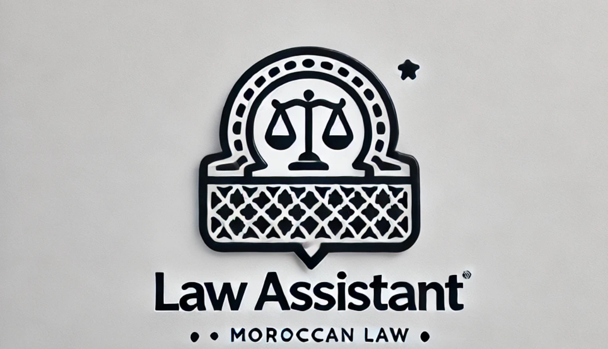

.. LawAssistant documentation master file, created by
   sphinx-quickstart on Tue Dec  3 16:03:03 2024.
   You can adapt this file completely to your liking, but it should at least
   contain the root `toctree` directive.

LawAssistant documentation
==========================

**supervised by:** M.MASROUR

**Realised by:** Lakhsassi Mariam and Jhabli Hassna

the link to our github repositry: `<https://github.com/mariam-lakhsassi/LawAssistant.git>`_.

Table of Contents
-----------------

- `Introduction <introduction_>`_
- `The Pipeline of Our Project <pipeline_>`_
    - `Data Collection <pipeline_>`_
    - `Data Preprocessing <pipeline_>`_
    - `Embedding Creation <pipeline_>`_
    - `Vector Database Creation <pipeline_>`_
    - `Retrieval and Answer Generation <pipeline_>`_
    - `Streamlit Interface <pipeline_>`_
- `Usage <usage_>`_
   
   
.. _introduction:

=================
Introduction
=================

Our law assistant can:

* Provide accurate answers to common legal questions about financial, commercial and labor law
* Assist in preparing simple legal documents
* Help users understand their rights and obligations under Moroccan law

.. _pipeline:

=================
The Pipeline of Our Project
=================

*Data Collection:*

We used existing PDF files of Moroccan laws and court decisions from the following government resources:

* adala.justice.gov.ma
* uriscassation.cspj.ma
* juricaf.org
* cg.gov.ma

*Data Preprocessing:*

We used pdfplumber to extract text from PDFs and langchain.text_splitter to split large legal documents into smaller, manageable chunks.

*Embedding Creation:*

Each chunk was embedded to create vector representations using the embedding model: mxbai-embed-large:latest.

*Vector Database Creation:*

We used Chroma to create and persist the vector database.

*Retrieval and Answer Generation:*

We used Chroma's similarity_search to retrieve the most relevant chunks of text from the vector database for the user's query. 

The answer to the user's query is generated using the llama2:7b model.

*Streamlit Interface:*

We developed a Streamlit-based user interface that allows:

* Uploading PDF files.
* Typing general legal questions.
* selecting the preferred language for chatbot responses.
* Viewing responses directly in the browser.

*Translator integration:*

The model we used (llama2:7b) generates answers in English by default . To make the responses more user-friendly for Moroccan users, we used  deep-translator as a translation model .
Users can select their preferred language Arabic or French through the settings. Based on their choice, the model will automatically translate the response into the desired language.

.. _usage:

==========
Usage
==========

To set up the chatbot application, follow these steps:

1. **Install Requirements**:

   Run the following command to install the required Python packages:

   .. code-block:: bash

      pip install -r requirements.txt

2. **Place Your Legal Documents**:

   Copy your legal documents into the `./documents` directory.

3. **Embed Texts and Create Vector Database**:

   Use the ingestion script to process and store embeddings for your documents by running:

   .. code-block:: bash

      python ingest.py

4. **Start the Chatbot Application**:

   Launch the chatbot using the following command:

   .. code-block:: bash

      streamlit run LLM.py

.. toctree::
   :maxdepth: 2
   :caption: Table of Contents

